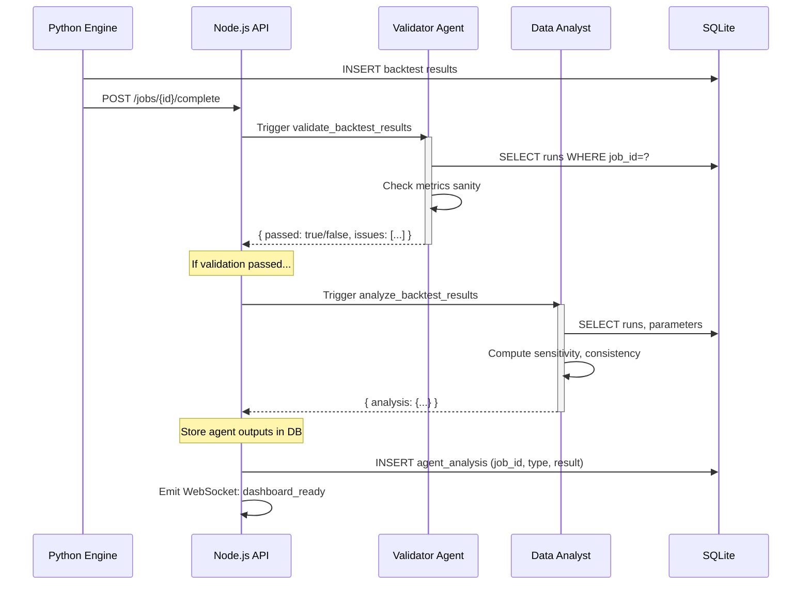

# AGENTS_AND_SKILLS.md — Autonomous Agents & Capabilities

## Executive Summary

This document defines autonomous agent roles and their capabilities in the Algo Trading Platform. Agents handle long-running or complex tasks without user interaction, reporting results asynchronously.

**Three core agents:**
1. **Code Generator Agent** — scaffold new indicators, tests, export adapters
2. **Validator Agent** — check strategy viability, test correctness, data consistency
3. **Data Analysis Agent** — analyze backtest results, detect regime patterns, suggest parameters

---

## 1. Agent Roles & Responsibilities

### Code Generator Agent

**Purpose:** Autonomously generate boilerplate code for new extensions.

**Triggers:**
- User adds indicator via UI (future feature)
- Developer requests "generate scaffold for new robustness test"
- API endpoint: `POST /api/agents/generate` (Phase 3+)

**Inputs:**
```json
{
  "agent_type": "code_generator",
  "task": "scaffold_indicator",
  "params": {
    "indicator_name": "Stochastic RSI",
    "indicator_type": "stochrsi",
    "parameters": [
      { "name": "rsi_period", "type": "int", "default": 14 },
      { "name": "stoch_period", "type": "int", "default": 14 }
    ],
    "language": "python"
  }
}
```

**Outputs:**
1. Function template (Python)
2. Unit test template (pytest)
3. Registry registration line
4. Documentation snippet (docstring)

**Capabilities:**
- Generate type-hinted Python/TypeScript code
- Create conformant unit tests (with fixtures)
- Inject code into correct files (via templating engine)
- Follow naming conventions automatically
- Output with code review checklist

**Constraints:**
- Cannot modify existing code (only create new files)
- Cannot commit to Git (developer must review + commit)
- Must output valid syntax (validated before returning)

**Example Workflow:**
```
Developer → API POST /agents/generate
         ↓
Agent receives: "scaffold_indicator: StochRSI"
         ↓
Agent generates:
  - engine/src/backtest/indicators/momentum.py (function)
  - engine/tests/unit/test_stochrsi.py (tests)
  - engine/src/backtest/indicators/__init__.py (registration line)
  - Checklist.md (what to do next)
         ↓
Returns JSON with all 4 files
         ↓
Developer reviews in IDE, runs tests, commits
```

---

### Validator Agent

**Purpose:** Verify strategy definitions, backtest results, and schema compliance.

**Triggers:**
- User submits strategy via wizard (validate LLM output)
- Backtest completes (validate metrics)
- New robustness test added (validate test output schema)

**Inputs:**
```json
{
  "agent_type": "validator",
  "task": "validate_strategy_definition",
  "payload": {
    "strategy": { /* StrategyDefinition v1 object */ },
    "level": "strict"  // or "lenient"
  }
}
```

**Tasks & Validations:**

| Task | What | Fail Conditions |
|------|------|-----------------|
| `validate_strategy_definition` | Check vs. JSON Schema, indicator refs, rule logic | Schema mismatch, unknown indicator, entry refs non-existent indicator |
| `validate_backtest_results` | Metrics sanity, equity curve monotonicity, PnL matches trades | NaN values, negative share ratio > 5, equity goes negative, PnL doesn't reconcile |
| `validate_robustness_report` | Test results structure, composite score (0-10), justification non-empty | Missing tests, score outside range, empty justification |
| `check_parameter_bounds` | Ensure optimized params are within original grid | Param outside grid range |

**Example: Validate Backtest Results**

```json
{
  "validations": {
    "schema_conformance": {
      "passed": true,
      "message": "Backtest runs conform to schema"
    },
    "metrics_sanity": {
      "passed": true,
      "checks": {
        "sharpe_ratio_range": { "passed": true, "value": 1.42, "expected_range": "(-100, 100)" },
        "max_drawdown_negative": { "passed": true, "value": -0.15, "expected_range": "(-1, 0)" },
        "win_rate_range": { "passed": true, "value": 0.62, "expected_range": "(0, 1)" },
        "profit_factor_positive": { "passed": true, "value": 1.85, "expected_range": "(0, inf)" }
      }
    },
    "equity_curve": {
      "passed": true,
      "checks": {
        "no_negative_equity": { "passed": true, "message": "Equity never went below initial" },
        "monotonic_during_trade": { "passed": true, "message": "Equity changes only at trade entries/exits" }
      }
    },
    "pnl_reconciliation": {
      "passed": true,
      "expected_pnl": 4500.0,
      "actual_pnl": 4500.0,
      "difference": 0.0
    }
  },
  "overall_passed": true,
  "severity": "info"
}
```

**Capabilities:**
- Detect impossible metric values (e.g., Sharpe = 1000)
- Cross-validate: PnL from trades == equity curve final value
- Check schema conformance (JSON Schema validation)
- Suggest corrections ("Did you mean this parameter?")
- Generate human-readable report

**Constraints:**
- Cannot modify data (read-only)
- Cannot approve strategies (only assess technical validity)
- Cannot override user judgment (report findings, let user decide)

---

### Data Analysis Agent

**Purpose:** Analyze backtest results and provide actionable insights.

**Triggers:**
- Backtest job completes (auto-analyze)
- User requests insight: "Which parameter combo is most robust?"
- Finding regime patterns (Phase 4+)

**Inputs:**
```json
{
  "agent_type": "data_analyst",
  "task": "analyze_backtest_results",
  "payload": {
    "job_id": "job-123",
    "analysis_type": "parameter_sensitivity"  // or "regime_consistency", "instrument_comparison"
  }
}
```

**Analysis Tasks:**

| Task | Input | Output |
|------|-------|--------|
| `parameter_sensitivity` | Backtest runs × params | Chart: param A vs. Sharpe, param B vs. Sharpe, heatmap of best combos |
| `regime_consistency` | Runs across instruments/timeframes | Consistency score (0-1), which combos work in all regimes, which fail |
| `instrument_comparison` | Runs per instrument | Best instrument, worst instrument, why (volatility? correlation?) |
| `drawdown_analysis` | Equity curve + trades | Max DD periods, average recovery time, frequency of new equity highs |
| `suggest_params` | User goal (e.g., "Maximize Sharpe while keeping DD < 20%") | Top N parameter sets meeting criteria, rank by trade-off |

**Example: Parameter Sensitivity Analysis**

```json
{
  "task": "parameter_sensitivity",
  "job_id": "job-123",
  "analysis": {
    "parameter_ranges": {
      "sma_period": [20, 50, 100],
      "breakout_threshold": [1.0, 1.5, 2.0]
    },
    "sensitivity_matrix": [
      [1.42, 1.38, 1.22],  // SMA=20
      [1.55, 1.62, 1.45],  // SMA=50
      [1.10, 1.28, 1.15]   // SMA=100
    ],
    "peak_performance": {
      "sharpe": 1.62,
      "params": { "sma_period": 50, "breakout_threshold": 1.5 },
      "stability": 0.85  // How robust is this to small param changes?
    },
    "robustness_score": 0.78,
    "interpretation": "SMA=50, breakout_threshold=1.5 is the sweet spot. Performance degrades gradually as you move away from this point, suggesting stable alpha."
  }
}
```

**Capabilities:**
- Detect optimal parameter regions (not just single peak)
- Measure robustness (how sensitive to param changes)
- Identify regime-specific parameters ("Works best in bull, fails in bear")
- Suggest parameter sets based on user constraints
- Visualize heatmaps, sensitivity surfaces

**Constraints:**
- Cannot modify parameters (analyze only)
- Cannot claim causation (only correlation)
- Cannot override backtest results (report anomalies for manual check)
- Must caveat: "Past performance ≠ future results"

---

## 2. Agent Capabilities Matrix

| Capability | Code Generator | Validator | Data Analyst |
|------------|-----------------|-----------|----------------|
| Generate code | ✅ | ❌ | ❌ |
| Validate schemas | ❌ | ✅ | ❌ |
| Detect anomalies | ❌ | ✅ | ✅ |
| Analyze trends | ❌ | ❌ | ✅ |
| Suggest improvements | ❌ | ❌ | ✅ |
| Modify data | ❌ | ❌ | ❌ |
| Approve/reject | ❌ | ❌ | ❌ |
| Commit code | ❌ | ❌ | ❌ |

---

## 3. Agent Input/Output Schemas

### Agent Request (API)

```json
{
  "agent_id": "agent-uuid",
  "agent_type": "code_generator | validator | data_analyst",
  "task": "specific_task_name",
  "params": {
    // Task-specific parameters
  },
  "timeout_seconds": 300,
  "priority": "normal"  // or "high", "low"
}
```

### Agent Response

```json
{
  "request_id": "req-uuid",
  "agent_id": "agent-uuid",
  "status": "completed | failed | timeout",
  "task": "specific_task_name",
  "result": {
    // Task-specific result
  },
  "metadata": {
    "execution_time_ms": 1234,
    "tokens_used": 5000,  // If LLM-based
    "errors": [],
    "warnings": ["Parameter X might be suboptimal"]
  }
}
```

---

## 4. Agent Execution Model

### Synchronous Agents (immediate response)

**Validator Agent:**
- Latency: < 1 second (local validation logic)
- Example: Validate strategy schema

```
POST /api/agents/validate
  ↓ [synchronous]
  ↓ JSON schema check + logic validation
Response 200: { passed: true, ... } or { passed: false, errors: [...] }
```

### Asynchronous Agents (long-running, polling)

**Code Generator Agent:**
- Latency: 5–30 seconds (calls LLM, generates multiple files)
- Example: Generate indicator scaffold

```
POST /api/agents/generate
  ↓ [async]
Response 202: { task_id: "task-123", status_url: "/agents/tasks/task-123" }

GET /agents/tasks/task-123
  ↓ [poll every 2s]
  ↓ Returns { status: "processing", progress_pct: 45 }
  ↓ Eventually: { status: "completed", result: { files: [...] } }
```

**Data Analysis Agent:**
- Latency: 10–60 seconds (loads backtest data, computes analysis)
- Example: Analyze parameter sensitivity

```
POST /api/agents/analyze
  ↓ [async, enqueued]
Response 202: { task_id: "task-456" }

GET /agents/tasks/task-456
  ↓ [poll or WebSocket]
  ↓ Returns analysis results when done
```

### Retry & Error Handling

- **Transient error** (LLM timeout): Retry(3x with exponential backoff)
- **Permanent error** (schema mismatch): Return error immediately
- **Timeout** (> limit): Kill task, return partial results + error

---

## 5. Integration Points

### 1. Backtest Job Completion → Auto-Validate + Analyze



### 2. New Robustness Test → Generate Scaffold + Validate

```
Developer: "Add WalkForward test"
  ↓
POST /api/agents/generate { task: "scaffold_robustness_test", ... }
  ↓
[Generator Agent]
  - Creates engine/src/robustness/walk_forward.py
  - Creates engine/tests/unit/test_walk_forward.py
  - Adds RobustnessRegistry.register('walk_forward', ...)
  ↓
Returns: { files: [...], checklist: [...] }
  ↓
Developer reviews (IDE), tests locally (pytest)
  ↓
Developer commits → CI runs tests + Validator runs
  ↓
If passes: Merged. Validator auto-runs on all new robustness jobs.
```

### 3. User Requests Insight → Data Analyst Responds

```
React Dashboard: User clicks "Analyze Parameters"
  ↓
POST /api/agents/analyze { job_id: "job-123", analysis_type: "parameter_sensitivity" }
  ↓
Node returns 202 + task_id
  ↓
WebSocket: task_id progress updates
  ↓
Analyst finishes: { heatmap: [...], peak_params: {...}, interpretation: "..." }
  ↓
React Dashboard renders heatmap + interpretation
```

---

## 6. Agent Autonomy Levels

| Level | Autonomy | Human Involvement | Example |
|-------|----------|-------------------|---------|
| **L1 (Passive)** | Read-only, report findings | Always review output | Validator: report but don't reject |
| **L2 (Advisory)** | Generate suggestions, no action | Review before approval | Analyst: suggest params, user confirms |
| **L3 (Action-then-report)** | Execute, report after | Review outcome | Code Generator: create files, notify developer |
| **L4 (Autonomous)** | Execute, alert only if issues | Exception-based feedback | Auto-analyze on every backtest (report visible in dashboard) |

**Current State (MVP):** L1–L3
**Future (Phase 4+):** L3–L4

---

## 7. Operational Considerations

### Resource Limits

```
Code Generator:
  - Max execution time: 60 seconds
  - Max API calls: 5 per minute (rate-limited)
  - Cost: ~$0.05 per generate call (LLM)

Validator:
  - Max execution time: 5 seconds (local logic)
  - No API calls (local)
  - Cost: $0

Data Analyst:
  - Max execution time: 120 seconds
  - Max backtest runs to analyze: 1000
  - Cost: ~$0.02 per analysis (small LLM calls)
```

### Monitoring & Logging

```python
# Log all agent executions
{
  "timestamp": "2026-02-18T10:00:00Z",
  "agent_id": "code_gen_1",
  "agent_type": "code_generator",
  "task": "scaffold_indicator",
  "status": "completed",
  "execution_time_ms": 8500,
  "tokens_used": 4200,
  "inputs": { "indicator_name": "StochRSI" },
  "output_files": 3,
  "errors": [],
  "cost": 0.05
}
```

### Failure Modes & Fallbacks

| Failure | Cause | Fallback |
|---------|-------|----------|
| Code Generator fails | LLM returned invalid syntax | Return error + template; developer writes manually |
| Validator flags anomaly | PnL doesn't reconcile | Report issue + raw data; developer investigates |
| Data Analyst times out | Too many runs to analyze | Return partial analysis (first 100 runs) + note |
| Agent quota exceeded | Rate limited | Queue and retry in 5 minutes |

---

## 8. Future Roadmap

### Phase 4: Advanced Agents

**Regime Detection Agent**
- Detect market regimes (bull, bear, sideways) from raw price data
- Trigger: After data fetch, before backtest
- Output: Regime classification + confidence, trigger for regime-specific parameters

**Backtests Debugger Agent**
- Analyze why a strategy failed (e.g., whipsaws, gap deaths)
- Trigger: User clicks "Why did this lose money?"
- Output: Heatmap of drawdown periods, suggested filter improvements

### Phase 5: Optimization Agents

**Parameter Optimizer Agent** (autonomous)
- Run Bayesian optimization end-to-end
- Trigger: User sets goal ("Maximize Sharpe, keep DD < 20%")
- Autonomy: Execute 1000s of backtests, suggest best params
- Output: Ranked parameter sets, convergence plot

---

## Next Steps

1. Implement Validator Agent (local schema + metrics checks)
2. Build Data Analyst Agent (parameter sensitivity analysis)
3. Integrate with backtest completion workflow
4. Test on real backtest artifacts
5. Add agent observability (metrics, logging, cost tracking)
