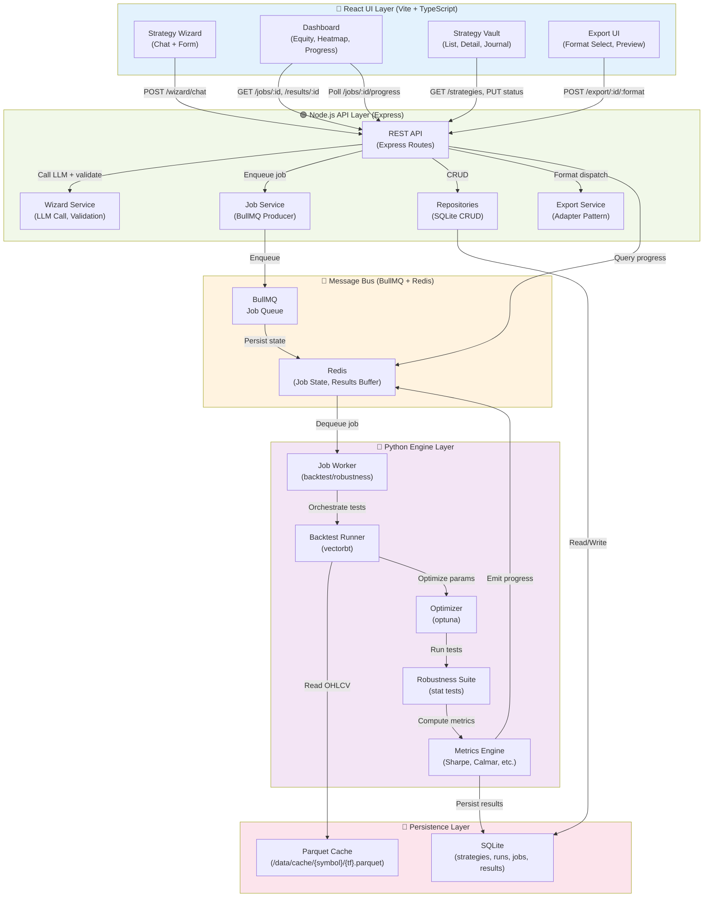
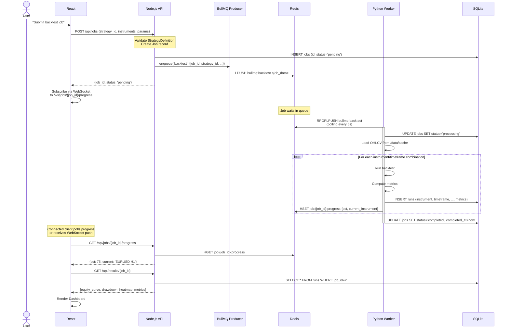
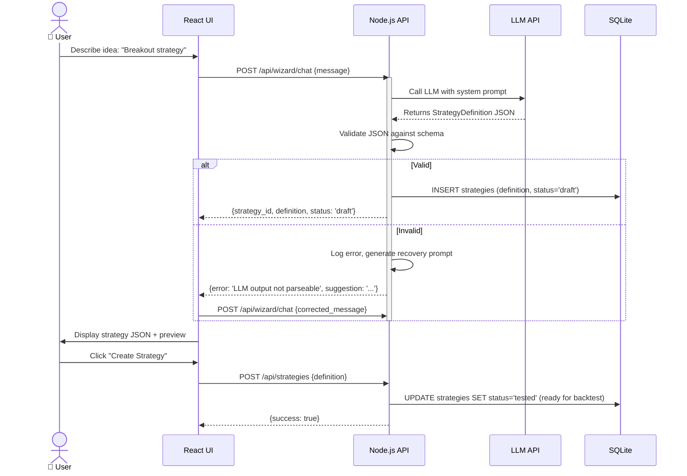
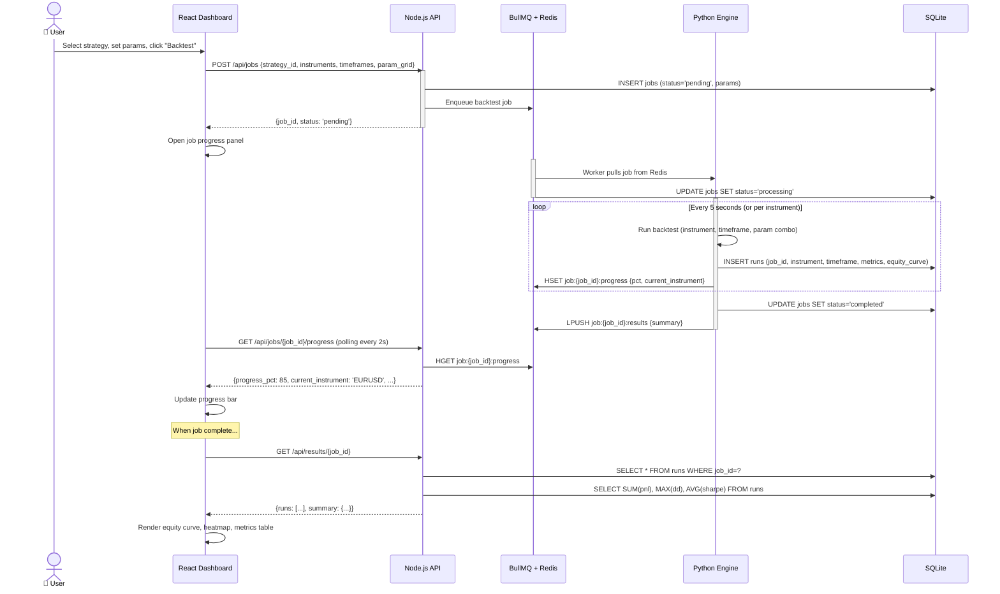
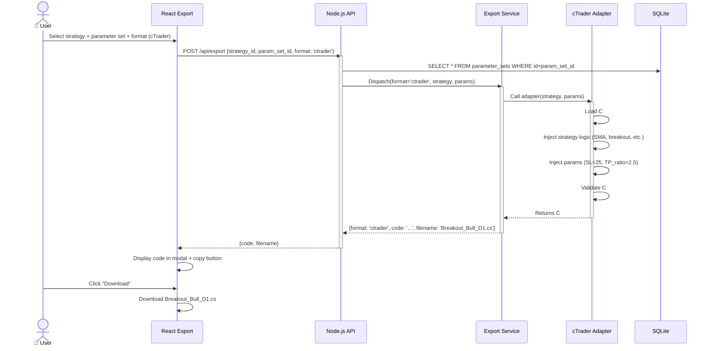
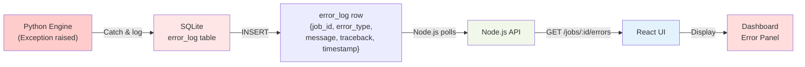

# ARCHITECTURE.md — Technical Design

## Executive Summary

This document defines the technical architecture of the Algo Trading Strategy Development Platform. The system uses **BullMQ + Redis** as the primary inter-process communication mechanism, enabling long-running Python backtest jobs to persist state, resume after interruption, and emit progress events. Clean layer boundaries isolate Python (compute), Node.js (orchestration), React (UI), and SQLite (persistence).

---

## 1. System Architecture Diagram

### High-Level Components & Data Flow



---

## 2. Layer Boundaries & Responsibilities

### React UI Layer

**Owns:**
- User interaction (forms, buttons, navigation)
- Client-side form validation (Zod schemas)
- State management (Zustand: wizard draft, active jobs, vault filters)
- WebSocket/SSE subscriptions to job progress
- Charting (lightweight-charts, recharts)
- Error display & retry UX

**Must NOT:**
- Call Python directly
- Write to SQLite
- Execute backtest logic
- Make decisions about strategy validity
- Store sensitive data (API keys) without encryption

**Communicates with:** Node.js API (HTTP/WebSocket only)

---

### Node.js API Layer

**Owns:**
- Route handling (Express middleware: auth, validation, error formatting)
- BullMQ job producer (enqueue backtest/robustness jobs)
- SQLite repository pattern (CRUD on all tables)
- LLM integration (OpenAI/Claude API calls with retry logic)
- Job orchestration (submit, poll status, retrieve results)
- Export adapter dispatch (select format, inject parameters, generate code)
- WebSocket server for live job progress
- Error aggregation (Python errors → SQLite error log → API error response)

**Must NOT:**
- Run long-running compute tasks (backtest, optimization)
- Execute arbitrary Python code
- Store strategy parameters in memory (use SQLite)
- Maintain direct TCP connection to Python (use BullMQ queue)

**Communicates with:**
- React UI (REST/WebSocket)
- Python engine (via BullMQ ← Redis)
- SQLite (better-sqlite3)
- External LLM API (OpenAI/Anthropic)

---

### Python Engine Layer

**Owns:**
- Backtest execution (vectorbt or backtesting.py)
- Indicator calculation (SMA, RSI, MACD, etc.)
- Parameter optimization (grid search, Bayesian via optuna)
- Robustness validation (walk-forward, Monte Carlo, OOS, sensitivity, trade shuffle)
- Metrics computation (PnL, Sharpe, Sortino, Calmar, profit factor, win rate, etc.)
- Incremental result persistence (update SQLite as each instrument/timeframe completes)
- Progress event emission (to Redis, polled by Node.js)

**Must NOT:**
- Serve HTTP requests
- Spawn child processes (except data loading)
- Make decisions about strategy acceptance (no approval logic)
- Store job state only in memory (must use SQLite + Redis for resume)
- Call external APIs directly (Node.js is the gatekeeper)

**Communicates with:**
- Node.js API (via BullMQ ← Redis)
- SQLite (sqlmodel/sqlite3)
- Market data cache (Parquet/CSV in `/data/cache`)

---

### SQLite Persistence Layer

**Owns:**
- Durable storage: strategies, runs, robustness reports, jobs, journals, tags, audit logs
- Foreign key relationships (runs → strategies, reports → runs)
- Transactional consistency (backtest results atomic)
- Schema versioning (alembic migrations)

**Must NOT:**
- Run compute queries (BI/analytics tools outside of platform)
- Authenticate users (optional; auth at API layer)
- Act as message queue (use Redis instead)

---

## 3. Python ↔ Node.js Communication via BullMQ + Redis

### Architecture



### Job Payload Schemas

#### Job Submission (Node → Redis)

```json
{
  "job_id": "uuid-1234-5678",
  "type": "backtest",
  "strategy_id": "strategy-uuid",
  "created_at": "2026-02-18T10:00:00Z",
  "params": {
    "instruments": ["EURUSD", "GBPUSD"],
    "timeframes": ["H1", "D1"],
    "parameter_grid": {
      "sma_period": [20, 50, 100],
      "breakout_threshold": [1.0, 1.5, 2.0],
      "slippage_pips": 2
    }
  }
}
```

#### Progress Event (Python → Redis)

```json
{
  "job_id": "uuid-1234-5678",
  "status": "processing",
  "progress_pct": 45,
  "current": {
    "instrument": "EURUSD",
    "timeframe": "H1",
    "iteration": 15,
    "total_iterations": 36
  },
  "elapsed_seconds": 3600,
  "estimated_remaining_seconds": 2400
}
```

#### Result Completion (Python → SQLite + Redis)

```json
{
  "job_id": "uuid-1234-5678",
  "status": "completed",
  "completed_at": "2026-02-18T12:00:00Z",
  "summary": {
    "total_runs": 36,
    "best_params": {
      "sma_period": 50,
      "breakout_threshold": 1.5
    },
    "best_sharpe": 1.85,
    "total_pnl": 4500.00,
    "win_rate": 0.62,
    "max_drawdown": -0.15
  },
  "results_location": "sqlite://job_id=uuid-1234-5678"
}
```

### BullMQ Configuration

```typescript
// api/src/queue/client.ts (pseudocode)
const queueConfig = {
  connection: {
    host: process.env.REDIS_HOST || 'localhost',
    port: process.env.REDIS_PORT || 6379,
  },
  defaultJobOptions: {
    attempts: 3,                          // Retry failed jobs 3x
    backoff: {
      type: 'exponential',               // 1s, 2s, 4s delays
      delay: 1000,
    },
    removeOnComplete: true,               // Clean up completed jobs after 1 hour
    removeOnFail: false,                  // Keep failed jobs for debugging
  },
};

const backrestQueue = new Queue('backtest', queueConfig);

// Enqueue a job
await backtestQueue.add('backtest', jobPayload, {
  jobId: jobPayload.job_id,
  delay: 0,                               // Start immediately
  priority: 10,                           // Higher = faster
});
```

### Retry & Resume Strategy

1. **Job crashes mid-execution:**
   - Python worker dies or network interrupts
   - BullMQ moves job to "failed" state after retries exhausted
   - Node.js marks job "failed" in SQLite with error message
   - User can retry (Node.js requeues job)

2. **Incremental persistence:**
   - Python writes results per instrument/timeframe immediately
   - If crash occurs at instrument 15/36, restart processes instruments 16–36
   - Resume ID tracked in `jobs` table: `resume_from_instrument`

3. **Timeout handling:**
   - Long-running optimization (e.g., 100k param combos): BullMQ job timeout = 24 hours
   - If timeout exceeded, Node.js marks failed; user can try with fewer params

---

## 4. Critical Data Flows

### Flow 1: Strategy Wizard → Creation



### Flow 2: Job Submission → Progress → Results



### Flow 3: Export Strategy



---

## 5. Error Handling & Resilience

### Error Propagation Matrix

| Layer | Error Type | Handling | Propagation |
|-------|-----------|----------|-------------|
| **React UI** | Invalid form input | Client-side Zod validation | User alert, highlight field |
| **React UI** | Network failure | Retry with exponential backoff | Toast notification + retry button |
| **Node.js API** | Invalid StrategyDefinition JSON | Validate vs. JSON Schema, return 400 | Suggest formula correction to user |
| **Node.js API** | LLM API timeout | Retry 3x, then fail job | Return 504 to user; suggest retry later |
| **Node.js API** | SQLite constraint violation | Log + rollback transaction | Return 409 (conflict) to user |
| **Python Engine** | Division by zero (metric calc) | Catch, log to error_log table, return NA | Job continues; result marked incomplete |
| **Python Engine** | Missing OHLCV data | Check file exists → if not, return 400 with file path | Job fails with actionable message |
| **Python Engine** | Optimizer timeout (optuna) | Kill after 12h, return best-so-far | Job completes with partial results |
| **Redis Queue** | Message serialization error | BullMQ has built-in JSON validation | Job rejected; error in queue admin UI |

### Python Error → SQLite → UI Flow



---

## 6. Design Patterns

### 1. **Repository Pattern** (Data Access)

**Where:** Node.js API + Python engine (for SQLite access)

**Rationale:** Isolate database queries; make testing easier (mock repositories in unit tests)

**Example (Node.js):**
```typescript
// api/src/db/repositories/strategy.repo.ts
export class StrategyRepository {
  constructor(private db: Database) {}
  
  async create(strategy: StrategyDefinition): Promise<string> {
    const stmt = this.db.prepare(
      `INSERT INTO strategies (id, definition, status, created_at)
       VALUES (?, ?, ?, ?)`
    );
    const id = randomUUID();
    stmt.run(id, JSON.stringify(strategy), 'draft', new Date());
    return id;
  }
  
  async findById(id: string): Promise<Strategy | null> {
    const stmt = this.db.prepare('SELECT * FROM strategies WHERE id = ?');
    return stmt.get(id) as Strategy | null;
  }
}
```

### 2. **Adapter Pattern** (Export Formats)

**Where:** Node.js export service

**Rationale:** Add cTrader, Pine Script, TradingView later without modifying core logic

**Interface:**
```typescript
// api/src/services/export/types.ts
export interface ExportAdapter {
  name: string;                           // 'ctrader', 'pine_script', etc.
  canExport(strategy: StrategyDefinition): boolean;
  export(strategy: StrategyDefinition, params: Parameters): Promise<string>;  // Returns code
}

// Usage
const adapters: Map<string, ExportAdapter> = new Map([
  ['ctrader', new CTraderAdapter()],
  ['pine_script', new PineScriptAdapter()],
]);

export async function exportStrategy(
  strategy: StrategyDefinition,
  params: Parameters,
  format: string
): Promise<string> {
  const adapter = adapters.get(format);
  if (!adapter) throw new Error(`Unknown format: ${format}`);
  return adapter.export(strategy, params);
}
```

### 3. **Job Pattern** (Long-Running Tasks)

**Where:** Python engine + BullMQ queue

**Rationale:** Cleanly model backtest/optimization as a discrete job with state transitions

**Job Lifecycle:**
```
pending → processing → completed (or failed/cancelled)
```

State stored in:
- SQLite `jobs` table (canonical state)
- Redis (transient progress updates)

### 4. **Factory Pattern** (Indicator Registration)

**Where:** Python engine indicator loading

**Rationale:** Dynamically register indicators; enable plugin architecture

**Implementation (Python):**
```python
# engine/src/backtest/indicators/__init__.py
class IndicatorRegistry:
    _registry: dict[str, Callable] = {}
    
    @classmethod
    def register(cls, name: str, fn: Callable):
        cls._registry[name] = fn
    
    @classmethod
    def get(cls, name: str) -> Callable:
        if name not in cls._registry:
            raise ValueError(f"Unknown indicator: {name}")
        return cls._registry[name]

# Register built-ins
IndicatorRegistry.register('sma', calculate_sma)
IndicatorRegistry.register('ema', calculate_ema)
IndicatorRegistry.register('rsi', calculate_rsi)
```

### 5. **State Machine** (Job Lifecycle)

**Where:** Node.js job service

**Rationale:** Enforce valid state transitions; prevent re-running completed jobs

```
┌─────────┐
│ pending │
└────┬────┘
     ↓
┌───────────┐
│processing │
└───┬───────┘
    ├──→ ┌───────────┐
    │    │completed  │
    │    └───────────┘
    │
    ├──→ ┌────────┐
    │    │ failed │
    │    └────────┘
    │
    └──→ ┌──────────┐
         │cancelled │
         └──────────┘
```

---

## 7. Deployment & Scaling Considerations

### Single-Machine Deployment (MVP)

```bash
# docker-compose.yml
services:
  redis:
    image: redis:7-alpine
    ports:
      - "6379:6379"
  
  api:
    build: ./api
    environment:
      REDIS_URL: redis://redis:6379
      DATABASE_URL: sqlite:///./algo_farm.db
    ports:
      - "3001:3001"
  
  engine-worker:
    build: ./engine
    environment:
      REDIS_URL: redis://redis:6379
      DATABASE_URL: sqlite:///./algo_farm.db
      PYTHONUNBUFFERED: 1
    depends_on:
      - redis
  
  ui:
    build: ./ui
    ports:
      - "5173:5173"
```

### Multi-Worker Python (Future)

```
Node.js API
     ↓
Redis Queue (BullMQ)
     ↓
┌─────────────────────────────────────────┐
│ Python Workers (N instances)             │
│ ├─ Worker 1 (backtest jobs)             │
│ ├─ Worker 2 (robustness validation)     │
│ └─ Worker 3 (optimization)              │
└────────────┬────────────────────────────┘
             ↓
        SQLite (shared DB)
```

Each worker is stateless; jobs distribute across pool. SQLite can be replaced with PostgreSQL if contention becomes an issue.

---

## 8. Standalone / Headless Mode (Phase 1)

The Python engine is designed to run **without any Node.js, Redis, or UI dependency**. This is the primary deployment mode in Phase 1 and remains a first-class interface in all subsequent phases.

### Use cases
- Developer testing a strategy locally from the terminal
- AI agent (e.g. Claude, OpenAI assistant) running on the same machine, executing experiment feedback loops autonomously
- CI/CD pipeline running backtest regression tests

### Invocation

```bash
python engine/run.py \
  --strategy path/to/strategy.json \
  --instruments EURUSD,GBPUSD \
  --timeframes H1,D1 \
  --param-grid path/to/param_grid.json \
  --optimize grid \
  --metric sharpe_ratio \
  --db ./algo_farm.db
```

### stdout protocol

The engine emits newline-delimited JSON to stdout. This makes it trivially parseable by any consumer — a shell script, a Python orchestrator, or an AI agent:

```
{"type": "progress", "pct": 25, "current": {"instrument": "EURUSD", "timeframe": "H1", "iteration": 3, "total": 12}}
{"type": "result", "instrument": "EURUSD", "timeframe": "H1", "params": {"sma_period": 20}, "metrics": {...}}
{"type": "completed", "job_id": "uuid", "best_params": {...}, "best_sharpe": 1.85, "db_path": "./algo_farm.db"}
```

Errors are emitted to stderr as plain text (not JSON) so they do not break parsers consuming stdout.

### Relationship to the full stack

In Phase 3+, the Node.js job service invokes the same CLI as a child process and consumes its stdout stream directly — no code duplication, no API surface change needed:

```
Node.js JobService
    ↓
spawn("python engine/run.py --strategy ... --db ...")
    ↓ stdout (JSONL)
Parse progress events → emit via WebSocket to React
    ↓ exit code 0
Read results from SQLite
```

**Key constraint:** The Python engine must never require a running Node.js server or Redis instance. Any configuration it needs (DB path, data cache path, log level) is passed via CLI flags or environment variables.

---

## Next Steps

1. Finalize BullMQ configuration & Redis connection handling
2. Implement job state machine in Node.js (startup → pending → processing → done)
3. Build Python job worker that polls BullMQ and executes backtest
4. Create SQLite schema with `jobs`, `runs`, `error_log` tables
5. Implement WebSocket progress endpoint in Node.js API
